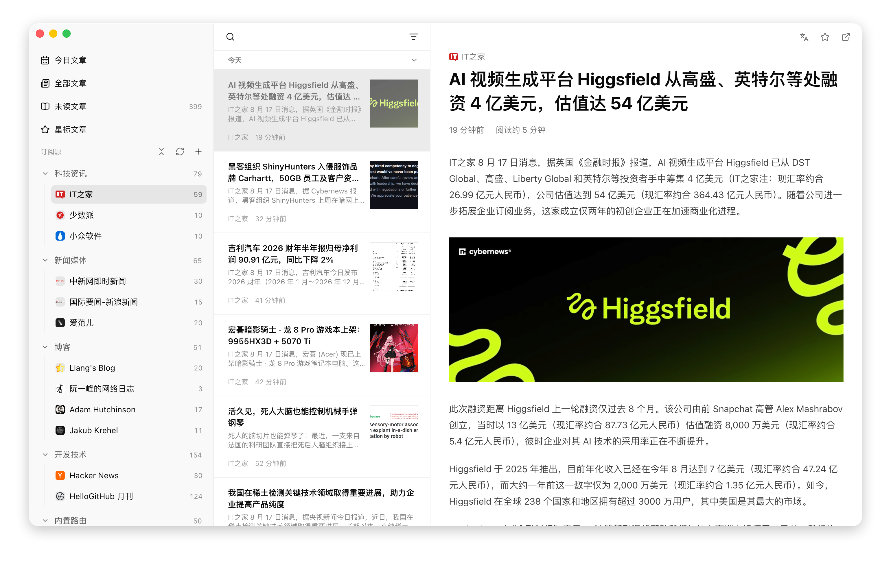

# Feed — 简洁的 RSS 阅读器

一个清爽、专注阅读的桌面端 RSS / Atom 订阅阅读器，支持 macOS / Windows / Linux。把你喜欢的博客、新闻、漫画站点聚合到一个地方，安静地读，告别一个个开网页。



## 特性

- **订阅 RSS / Atom**：把喜欢的网站添加进来，一处聚合阅读
- **内置路由**：内置 V2EX 热帖、B 站 UP 主专栏 / 视频、Telegram 频道、HapiGo 更新日志等站点订阅，没有 RSS 的网站也能直接订阅
- **分类/星标**：给订阅源分组，支持拖拽排序，好文章一键星标，随时回看
- **全文搜索**：本地全文索引，秒搜所有历史文章
- **文章翻译**：一键将整篇文章翻译为中文，保留排版与代码块，可随时切回原文
- **多端同步**：订阅源与分类自动同步，支持 GitHub Gist / Gitee / WebDAV
- **OPML 导入 / 导出**：从旧阅读器一键搬家，也能随时备份带走
- **深色 / 浅色主题**：跟随系统或手动切换

## 下载安装

到 [GitHub Releases](https://github.com/lianginx/feed/releases) 下载对应平台的安装包：

| 平台    | 安装包                                       |
| ------- | -------------------------------------------- |
| macOS   | `Feed-<版本号>.dmg`                          |
| Windows | `feed-<版本号>-setup.exe`                    |
| Linux   | `Feed-<版本号>.AppImage`（另有 `.deb` 可选） |

> [!NOTE]
> 应用主要在 macOS 上开发和测试，Windows / Linux 版本目前可正常使用，但部分体验（如菜单栏交互、窗口样式）尚未精细打磨，如有问题欢迎在 [Issues](https://github.com/lianginx/feed/issues) 反馈。

> [!WARNING]
> **macOS 首次打开可能被系统拦截**：应用目前未做 Apple 签名和公证，Gatekeeper 会提示无法验证开发者，也可能出现下面两种情况：

**情况一：提示「无法验证开发者」**

右键（或按住 `Ctrl` 点击）应用图标 → 选择「打开」→ 再点一次「打开」即可运行。

**情况二：提示「应用已损坏，无法打开」**

这是未签名应用被 Gatekeeper 拦下的**假损坏**（文件没有坏）。需要先在「终端」里执行命令，清除系统的隔离标记：

```bash
xattr -cr /Applications/Feed.app
```

## 内置路由

**内置路由**是 Feed 的特色：很多网站没有提供 RSS，Feed 为这些站点内置了直达通道，不用自己找第三方 RSS 服务也能订阅。

> 这个功能很大程度上受到了 [RSSHub](https://docs.rsshub.app/zh/) 的启发 —— 我很喜欢这个项目。
>
> 若内置路由还没有适配你想要的站点，可以在 [RSSHub 路由](https://docs.rsshub.app/zh/routes/) 里寻找，通过 [部署私有 RSSHub](https://docs.rsshub.app/zh/deploy/) 或使用 [公共实例](https://docs.rsshub.app/zh/guide/instances) 为它生成一个 RSS 订阅地址，然后粘贴进来。

| 路由            | 说明                | 需要填写的参数                       | 是否需要登录 |
| --------------- | ------------------- | ------------------------------------ | ------------ |
| V2EX 热帖       | V2EX 最热主题       | 无                                   | 否           |
| B 站 UP 主专栏  | UP 主发布的图文     | UP 主 ID（如 `928915`）              | 否           |
| B 站 UP 主视频  | UP 主投稿视频       | UP 主 ID                             | 可选         |
| Telegram 频道   | 频道消息            | 频道用户名（如 `NewlearnerChannel`） | 否           |
| HapiGo 更新日志 | HapiGo 官方更新日志 | 无                                   | 否           |

> **B 站视频订阅不稳定？** 部分站点（如 B 站视频）登录后更稳定。在「设置 → 内置路由」里点「用浏览器登录」即可；不登录也能订阅公开内容，只是偶尔不稳定。

> **UP 主 ID 怎么找？** 打开 UP 主的主页，地址栏 `space.bilibili.com/` 后面那串数字就是，例如 `https://space.bilibili.com/928915` 中的 `928915`。

## 快速上手

1. **添加订阅源**：点击侧边栏顶部的「+」→ 在「添加订阅源」窗口粘贴博客 / 网站的 RSS 地址（例如 `https://example.com/feed.xml`），或切换到**内置路由**卡片直接选择支持的站点（支持列表见[内置路由](#内置路由)）→ 确定。应用会自动识别标题和图标。
2. **整理分类**：右键侧边栏空白处可以新建分类；右键分类或订阅源可重命名、编辑、删除；直接拖拽即可调整顺序，把订阅源拖到其他分类下即可移动。
3. **开始阅读**：点击左侧订阅源 → 中间的文章列表 → 点击任意文章即可阅读。选中文章后，用 `Cmd / Ctrl + D` 收藏（星标）、`Cmd / Ctrl + E` 标记已读 / 未读。

> **不知道怎么找 RSS 地址？** 大多数网站页面底部都有「RSS / 订阅」链接，或直接在域名后加 `/feed`、`/rss`、`/atom.xml` 试试。也可以从旧阅读器导出 OPML 文件，通过「导入 OPML」整体搬进来。没有 RSS 的站点（如 B 站）可以直接用「内置路由」订阅，不用自己找第三方服务。

## 快捷键

| 快捷键                   | 功能                    |
| ------------------------ | ----------------------- |
| `Cmd / Ctrl + N`         | 添加订阅源              |
| `Cmd / Ctrl + R`         | 刷新当前订阅源          |
| `Cmd / Ctrl + Shift + R` | 刷新全部订阅源          |
| `Cmd / Ctrl + F`         | 搜索文章                |
| `Cmd / Ctrl + E`         | 标为已读 / 标记未读     |
| `Cmd / Ctrl + Shift + E` | 当前列表全部标为已读    |
| `Cmd / Ctrl + D`         | 收藏 / 取消收藏（星标） |
| `Cmd / Ctrl + Shift + A` | 全部订阅源标为已读      |
| `Alt + T`                | 翻译当前文章 / 显示原文 |
| `Alt + Shift + T`        | 强制重新翻译当前文章    |
| `Cmd / Ctrl + ,`         | 打开设置                |

> 翻译功能默认启用微软翻译（免费，无需配置）；如需改用百度翻译，在设置中填入申请好的密钥即可。

## 常见问题

### 我的数据存在哪里？
所有订阅和文章都保存在你电脑本地，数据完全属于你自己。数据库文件位置：

| 平台    | 路径                                                  |
| ------- | ----------------------------------------------------- |
| macOS   | `~/Library/Application Support/com.lianginx.feed/feed.db` |
| Windows | `%APPDATA%\com.lianginx.feed\feed.db`                 |
| Linux   | `~/.config/com.lianginx.feed/feed.db`                 |

### 如何从别的阅读器迁移？
在旧阅读器里导出 OPML 文件 → 在本应用菜单里选择「导入 OPML」即可。以后想换工具，也可以随时「导出 OPML」把数据带走。

### 怎么更新到新版本？
应用会自动检查更新并在后台下载，重启后完成升级；也可以随时点菜单栏「检查更新…」手动检查。

### 我订阅的网站没有 RSS 怎么办？
先看看**内置路由**里有没有适配过——目前内置 V2EX 热帖、B 站 UP 主专栏与视频、Telegram 频道、HapiGo 更新日志（见[内置路由](#内置路由)），直接选择即可订阅。若没有对应站点，也可以参考[内置路由](#内置路由)章节里提到的 RSSHub 方案。

### 内置路由是怎么实现的？
普通网站（如 V2EX、Telegram）：应用直接帮你把网站上的公开内容整理成文章列表，就像你自己打开网页看一样。

反爬严格的网站（如 B 站视频）：应用会在后台帮你打开页面读取内容，必要时借助你配置的登录信息，更稳定。

订阅之后的刷新、阅读、搜索等操作，和普通 RSS 订阅源完全一样。

## 开发者

Feed 基于 Electron + Vue 3 + TypeScript 构建。想本地开发或参与贡献：

```bash
pnpm install     # 安装依赖
pnpm dev         # 启动开发环境（热重载）
pnpm typecheck   # 类型检查
pnpm build       # 类型检查 + 构建产物
pnpm build:mac   # 打包 macOS 安装包（build:win / build:linux 同理）
```

更多架构、数据库、发布细节见 [docs/](./docs/) 目录下的文档，发版流程见 [docs/release.md](./docs/release.md)。
