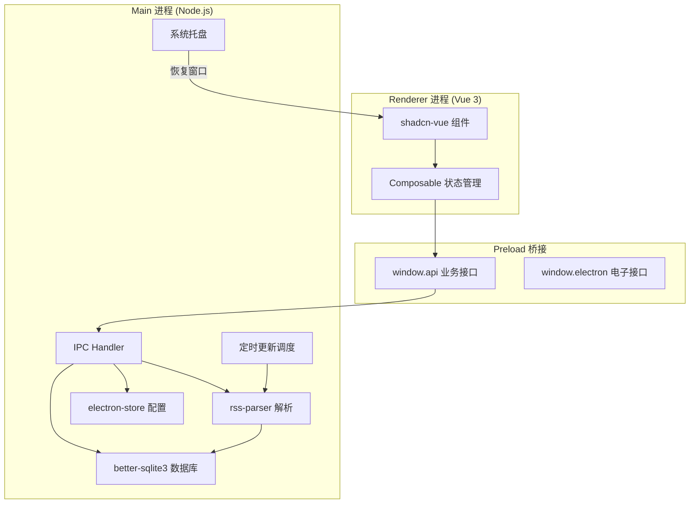

# 架构设计

> 详见 [README.md](./README.md) 了解项目全貌。

## ⚠️ 安全注意事项

- **RSS 文章内容必须使用 DOMPurify 净化后再渲染**（rss-parser 不做任何 XSS 过滤）
- **禁止使用 `v-html` 直接渲染未净化的 HTML**（Electron 中 XSS 危害更大）
- 详见：https://github.com/cure53/DOMPurify#readme

### Content-Security-Policy

```html
<meta http-equiv="Content-Security-Policy"
  content="default-src 'self';
         script-src 'self';
         style-src 'self' 'unsafe-inline';
         img-src 'self' data: https:;
         media-src 'self' https:;
         font-src 'self' data:;">
```

- `img-src` 允许 `https:` — RSS 文章中的外部图片可正常加载
- `media-src` 允许 `https:` — 文章中的视频/音频可播放
- 脚本严格限制 `'self'` — XSS 攻击面最小化
- 文章 HTML 仍必须 DOMPurify 净化（双层防护）

### API Key 存储

非敏感配置（主题、字体大小等）和敏感凭据（LLM API Key、GitHub Token）统一使用 **electron-store 明文存储**。不做额外加密，与 VSCode / OpenCode 等主流桌面工具的做法一致。

## IPC 通信设计

沿用 electron-vite 默认的 preload 设计：
- `window.electron`：electron-vite 内置的 `electronAPI`（ipcRenderer 封装）
- `window.api`：业务 API 对象（在 preload/index.ts 的 `api` 对象中扩展）

```typescript
// preload/index.ts 扩展示例
const api = {
  // 订阅源相关
  feeds: {
    list: () => ipcRenderer.invoke('feeds:list'),
    add: (feed: AddFeedParams) => ipcRenderer.invoke('feeds:add', feed),
    update: (id: number, data: Partial<Feed>) => ipcRenderer.invoke('feeds:update', id, data),
    delete: (id: number) => ipcRenderer.invoke('feeds:delete', id),
    updateSortOrder: (feeds: { id: number; sort_order: number }[]) =>
      ipcRenderer.invoke('feeds:updateSortOrder', feeds),
  },
  // 分类相关
  categories: {
    list: () => ipcRenderer.invoke('categories:list'),
    add: (name: string) => ipcRenderer.invoke('categories:add', name),
    update: (id: number, name: string) => ipcRenderer.invoke('categories:update', id, name),
    delete: (id: number) => ipcRenderer.invoke('categories:delete', id),
  },
  // 文章相关
  articles: {
    list: (params: {
      feedId?: number
      filter?: 'all' | 'unread' | 'starred'
      cursor?: { publishedAt: number; id: number }
      limit?: number
    }) => ipcRenderer.invoke('articles:list', params),
    get: (id: number) => ipcRenderer.invoke('articles:get', id),
    markRead: (id: number) => ipcRenderer.invoke('articles:markRead', id),
    markAllRead: (feedId?: number) => ipcRenderer.invoke('articles:markAllRead', feedId),
    toggleStar: (id: number) => ipcRenderer.invoke('articles:toggleStar', id),
    search: (query: string) => ipcRenderer.invoke('articles:search', query),
  },
  // 配置相关
  config: {
    get: () => ipcRenderer.invoke('config:get'),
    update: (settings: Partial<AppSettings>) => ipcRenderer.invoke('config:update', settings),
  },
  // 刷新相关
  sync: {
    refreshFeed: (feedId: number) => ipcRenderer.invoke('sync:refreshFeed', feedId),
    refreshAll: () => ipcRenderer.invoke('sync:refreshAll'),
  },
}
```

## IPC 错误处理策略

所有 IPC 调用统一返回 `{ success: boolean, data?: T, error?: string }` 格式：

```typescript
// Main 进程 IPC handler 示例
ipcMain.handle('feeds:add', async (_event, feed: AddFeedParams) => {
  try {
    const result = db.prepare('INSERT INTO feeds (url, title, category_id) VALUES (?, ?, ?)').run(feed.url, feed.title, feed.categoryId)
    return { success: true, data: { id: result.lastInsertRowid } }
  } catch (error) {
    return { success: false, error: error.message }
  }
})

// Renderer 进程调用示例
const result = await window.api.feeds.add({ url: '...', title: '...', categoryId: 1 })
if (!result.success) {
  toast.error(result.error)  // 使用 shadcn-vue 的 Toast 组件显示错误
}
```

## 进程交互图



## 容错策略

| 场景           | 策略                                                                       |
| -------------- | -------------------------------------------------------------------------- |
| RSS 请求超时   | 默认 15s 超时，超时返回 `{ success: false, error: 'timeout' }`，不自动重试 |
| RSS 解析失败   | 捕获异常，返回友好错误信息，不中断其他 feed 的刷新                         |
| 网络错误       | 记录到 feed 的 `last_error` 字段，下次刷新时清除                           |
| 无效 feed URL  | 添加时验证 URL 格式 + 尝试解析，失败则提示用户                             |
| 恶意 HTML      | 所有文章内容入库前强制 DOMPurify 净化，不存在"不净化"的路径                |
| 数据库写入失败 | IPC 统一 `{ success, data?, error? }` 格式，渲染层 toast 提示              |
| 连续错误暂停   | 连续错误 ≥5 次后自动暂停该 feed 的定时刷新，UI 中标记为"已暂停"            |
