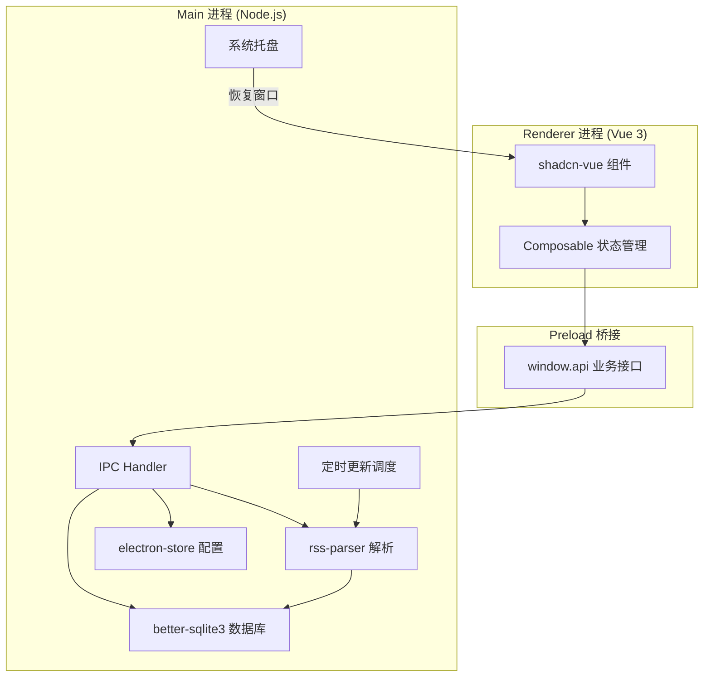

# 架构设计

> 详见 [README.md](./README.md) 了解项目全貌。

## ⚠️ 安全注意事项

- **RSS 文章内容必须使用 DOMPurify 净化后再渲染**（rss-parser 不做任何 XSS 过滤）
- **禁止使用 `v-html` 直接渲染未净化的 HTML**（Electron 中 XSS 危害更大）
- 详见：https://github.com/cure53/DOMPurify#readme

### Content-Security-Policy

```html
<meta
  http-equiv="Content-Security-Policy"
  content="default-src 'self';
         script-src 'self';
         style-src 'self' 'unsafe-inline';
         img-src 'self' data: https:;
         media-src 'self' https:;
         font-src 'self' data:;"
/>
```

- `img-src` 允许 `https:` — RSS 文章中的外部图片可正常加载
- `media-src` 允许 `https:` — 文章中的视频/音频可播放
- 脚本严格限制 `'self'` — XSS 攻击面最小化
- 文章 HTML 仍必须 DOMPurify 净化（双层防护）

### API Key 存储

非敏感配置（主题、字体大小等）和敏感凭据（LLM API Key、GitHub Token）统一使用 **electron-store 明文存储**。不做额外加密，与 VSCode / OpenCode 等主流桌面工具的做法一致。

## IPC 通信设计

沿用 electron-vite 默认的 preload 设计：

- `window.api`：业务 API 对象（在 preload/index.ts 的 `api` 对象中扩展）。所有事件订阅都通过 `api.*.onXxx(cb)` 包裹回调并剥离 `IpcRendererEvent`，只透传业务数据；不再暴露原始 `ipcRenderer`（遵循 Electron 安全规则 #20）

```typescript
// preload/index.ts 扩展示例
const api = {
  // 订阅源相关
  feeds: {
    list: () => ipcRenderer.invoke('feeds:list'),
    add: (feed: AddFeedParams) => ipcRenderer.invoke('feeds:add', feed),
    update: (id: number, data: Partial<Feed>) => ipcRenderer.invoke('feeds:update', id, data),
    delete: (id: number) => ipcRenderer.invoke('feeds:delete', id),
    updateSortOrder: (feeds: { id: number; sort_order: number }[]) =>
      ipcRenderer.invoke('feeds:updateSortOrder', feeds)
  },
  // 分类相关
  categories: {
    list: () => ipcRenderer.invoke('categories:list'),
    add: (name: string) => ipcRenderer.invoke('categories:add', name),
    update: (id: number, name: string) => ipcRenderer.invoke('categories:update', id, name),
    delete: (id: number) => ipcRenderer.invoke('categories:delete', id)
  },
  // 文章相关
  articles: {
    list: (params: {
      feedId?: number
      categoryId?: number | null
      filter?: 'all' | 'unread' | 'starred'
      query?: string
      cursor?: { publishedAt: number; id: number }
      limit?: number
    }) => ipcRenderer.invoke('articles:list', params),
    get: (id: number) => ipcRenderer.invoke('articles:get', id),
    markRead: (id: number) => ipcRenderer.invoke('articles:markRead', id),
    markAllRead: (feedId?: number) => ipcRenderer.invoke('articles:markAllRead', feedId),
    toggleStar: (id: number) => ipcRenderer.invoke('articles:toggleStar', id)
  },
  // 配置相关
  config: {
    get: () => ipcRenderer.invoke('config:get'),
    update: (settings: Partial<AppSettings>) => ipcRenderer.invoke('config:update', settings)
  },
  // 同步相关
  sync: {
    run: () => ipcRenderer.invoke('sync:run'),
    resolve: (choice: 'local' | 'remote') => ipcRenderer.invoke('sync:resolve', choice),
    status: () => ipcRenderer.invoke('sync:status')
  }
}
```

## IPC 错误处理策略

所有 IPC 调用统一返回 `{ success: boolean, data?: T, error?: string }` 格式：

```typescript
// Main 进程 IPC handler 示例
ipcMain.handle('feeds:add', async (_event, feed: AddFeedParams) => {
  try {
    const result = db
      .prepare('INSERT INTO feeds (url, title, category_id) VALUES (?, ?, ?)')
      .run(feed.url, feed.title, feed.categoryId)
    return { success: true, data: { id: result.lastInsertRowid } }
  } catch (error) {
    return { success: false, error: error.message }
  }
})

// Renderer 进程调用示例
const result = await window.api.feeds.add({ url: '...', title: '...', categoryId: 1 })
if (!result.success) {
  toast.error(result.error) // 使用 shadcn-vue 的 Toast 组件显示错误
}
```

## 进程交互图



### 路由框架架构（Source 通道分发）

适配器是「内置路由」的声明式描述：`params` 驱动添加订阅表单，`parse` 把抓取内容解析为统一 `ParsedFeed`。新架构把「取数方式」提升为适配器的一等概念，未来新增非 HTTP 数据源（如 Telegram MTProto）无需改动框架分发逻辑。

核心概念：

- **source**：适配器声明的数据源类型。划分标准是**数据契约形态**而非传输实现——`http` 适配器产出原始文本（HTML/JSON），`telegram` 适配器产出结构化消息对象。
- **SourceRunner**：对应 source 的执行器，实现 `run(adapter, params, options) → ParsedFeed`。
- **分发器**（`core/runner.ts`）：按 `adapter.source` 查 `sourceRunners` 注册表；未声明 source 的适配器走**内置 http runner**（默认路径，即原 `buildUrl → fetch → parse` 流程）。

http 与 browser 产出同一种形态（原始文本），归入同一 source，用 `needsBrowser` 标志选择 fetcher（`core/fetcher/http.ts` / `browser.ts`）。

目录结构（telegram source 为二期，见下节）：

```
routes/
  types.ts          # 契约：FeedAdapter 判别联合、SourceKind、SourceRunner
  core/
    runner.ts       # 分发器 + registerSource + 内置 http runner
    registry.ts     # 适配器注册表
    fetcher/        # http.ts / browser.ts
    limit.ts        # HTTP/浏览器并发上限
    extract.ts      # 文本/封面提取辅助
  adapters/
    index.ts        # 集中注册：registerAdapter + registerSource
    telegram/
      index.ts      # 二期：适配器定义（source: 'telegram'）
      source.ts     # 二期：telegram SourceRunner（复用 services/telegram 连接服务）
    v2ex/ bilibili/ # http 适配器（不声明 source，零改动）
```

新增数据源 = `types.ts` 加一个 SourceKind + 适配器接口 + `adapters/<feature>/source.ts` + `adapters/index.ts` 一行注册。分发器与 core 永不改。

### Telegram 订阅（MTProto）

> **状态：二期 · 阻塞中（待 api_id/api_hash 申请成功）**。当前仍使用 t.me/s web 解析适配器（普通 http 适配器）作为过渡，一期不涉及 Telegram 改动。以下为二期目标设计。

- 技术栈：**mtcute**（纯 TS 实现 MTProto、无 native 依赖、内置 SOCKS5/HTTP/MTProxy transport）
- 凭据：用户自备 `api_id/api_hash`（my.telegram.org 免费即时申请），全局单账号，**二维码登录**
- 订阅范围：
  - 公开频道 / 受限频道（web 受限但客户端可预览）：`resolveUsername` + `getHistory`，不加入即可读
  - 私有频道（invite-only）：用户先在官方客户端手动加入，再从账号已加入频道列表（`messages.getDialogs`）选择
- 更新机制：定时轮询增量（`getHistory` + `offset_id`），每次刷新周期连接一次、读完所有 Telegram 订阅后断开；媒体下载时按需再连
- 媒体：图片+音频下载到本地缓存，视频给缩略图 + t.me 跳转链接，文档给链接
- 统一缓存 `services/cache/`：favicon（保留 `favicon://`，DB 记录零迁移）+ media（新增 `media://`，需扩展 CSP img-src/media-src），容量上限 LRU 淘汰 + 手动清理，懒加载
- 全局代理：默认自动跟随系统代理 + 手动覆盖，覆盖 MTProto / Node fetch / 浏览器三条路径
- 风险提示：登录时提示账号封号风险；api_hash 为永久密钥不可重置，提示妥善保管
- 待验证（开工前 spike）：受限频道非成员 `getHistory` 可读性；账号所属地区对 sensitive/porno 内容的限制

## 容错策略

| 场景           | 策略                                                                       |
| -------------- | -------------------------------------------------------------------------- |
| RSS 请求超时   | 默认 15s 超时，超时返回 `{ success: false, error: 'timeout' }`，不自动重试 |
| RSS 解析失败   | 捕获异常，返回友好错误信息，不中断其他 feed 的刷新                         |
| 网络错误       | 记录到 feed 的 `last_error` 字段，下次刷新时清除                           |
| 无效 feed URL  | 添加时验证 URL 格式 + 尝试解析，失败则提示用户                             |
| 恶意 HTML      | 所有文章内容入库前强制 DOMPurify 净化，不存在"不净化"的路径                |
| 数据库写入失败 | IPC 统一 `{ success, data?, error? }` 格式，渲染层 toast 提示              |
| 连续错误暂停   | 连续错误 ≥5 次后自动暂停该 feed 的定时刷新，UI 中标记为"已暂停"            |
