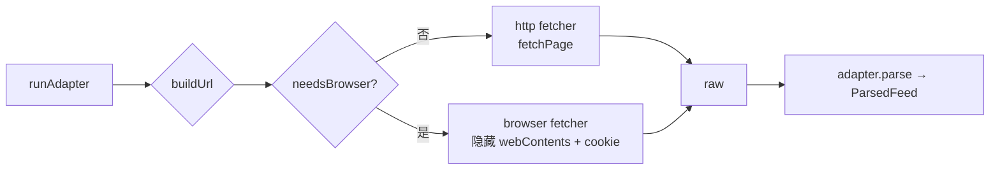

# Plan: 内置站点适配器（RSSHub 式逐站抓取/解析）

## 目标
- 内置「站点适配器」体系：像 RSSHub 那样，**每个目标站点一个专门的抓取/解析脚本**，用户可以直接选择我们适配过的站点订阅
- 复用 Electron 内核：适配器可选择 **HTTP 抓取**（默认，便宜）或 **隐藏 webContents（Chromium 渲染）抓取**（needsBrowser，解决反爬/JS 渲染站）
- 统一输出 `ParsedFeed`，复用现有刷新 / favicon / 去重 / 入库管线，**现有 RSS 订阅完全不受影响**

## 背景与动机
- 很多消息源不提供 RSS → 只能抓原网页解析
- **RSSHub 模式**：逐站定制 route，而非通用抓取（通用解析质量差、易碎）
- 我们比 RSSHub 多一张牌：本地 Electron 直接内置 Chromium，JS 渲染/反爬站可以真跑浏览器，成功率高
- 数据不出本地，隐私好；无第三方服务依赖

## 已确认决策
1. **定位 = 内置版 RSSHub**（用户选定），不引入 Puppeteer/Playwright（Electron 自带内核即够）
2. **逐站开发抓取/解析脚本**，用户在添加订阅源时可选择适配过的站点（用户选定）
3. 直接依赖 Electron 与主进程 Node 提供的环境（fetch / webContents / cheerio / jsdom / DOMPurify 均已有）
4. 当前阶段：**先落方案文档**，后续按路线图逐步实施
5. **路径选定 = C：参考 RSSHub 设计、自研精品路由**（见「路径决策」）——不内嵌 RSSHub 代码（避免 AGPL 传染与体积/内存暴涨），也不依赖远程实例（数据不出本地）
6. **fetcher 分层已实测确认**：优先 HTTP（先试接口），被签名/风控拦截才用浏览器（needsBrowser）；登录态注入必须显式 cookie domain（见「B 站 PoC 验证」）

## 路径决策（A/B/C 对比）

| 路径 | 做法 | 结论 |
| --- | --- | --- |
| **A 实例模式**（Folo 官方做法） | 客户端只做路由浏览，抓取走官方/公共/自建 RSSHub 实例 | ✅ 成本最低、立即可用；但依赖远程实例稳定性、数据过第三方 → 作为**独立可选增强**备选，不与 C 冲突 |
| **B 库式内嵌** | 官方提供 `lib/pkg.ts` 的 `init()`+`request()` 库式 API，打包进主进程本地执行 | ❌ RSSHub 为 **AGPL-3.0** → 整个项目被迫 AGPL 开源；依赖 60+（含 patchright 需额外 Chromium）、打包体积 400MB+、内存 +200~400MB；Node engines 卡 Electron 边界 → **否决** |
| **C 参考设计自研（选定）** | 借鉴 RSSHub「路由元数据 + 逐站 handler」设计，自维护精选适配器 | ✅ 无许可问题、体积可控、数据不出本地、按需加站；代价是自研成本 |

**结论**：B 的 AGPL 传染与体积不可接受；A 可在 C 之后作为「RSSHub 路由浏览」独立功能再加。

## 借鉴边界（AGPL-3.0 合规）

RSSHub 为 AGPL-3.0。版权只保护「具体表达（代码文本）」，不保护「思想 / 接口设计 / 数据结构」。自研可借鉴其设计，但**不得复制其源码**：

**可借鉴（不构成衍生作品）**
- Route 元数据 schema 的字段设计（path/name/example/parameters/categories/features 声明式结构）
- 目录组织（按站点分目录）、fetcher/解析工具分层思路
- radar 规则思路（RSSHub Radar 独立项目为 MIT，source/target 匹配规则可自由参考）
- docs.rsshub.app 路由页的公开信息（有哪些站、参数怎么填）

**禁止（构成衍生作品 → 传染 AGPL）**
- 复制 handler 函数体、成段解析逻辑
- 复制具体 CSS 选择器组合、签名/token 算法实现
- 整文件拷贝 RSSHub 源码进本项目

**实践守则**：不把 RSSHub 任何源码文件拷入项目；每个适配器按目标站**当前页面结构重新编写**选择器与解析；用文档了解「适配哪些站」后自行实现。

## B 站 PoC 验证（2026-08-06 已完成）

用真实 B 站验证「HTTP vs 浏览器」分层与登录态注入，关键结论：

1. **`/bilibili/user/article`（专栏）→ 不需要浏览器**
   - RSSHub 标 `requirePuppeteer: false`；实测纯 HTTP + `Referer` 调 `opus/feed/space` 返回 `code:0` → 走普通 HTTP 适配器（同 V2EX）
2. **`/bilibili/user/video`（视频）→ 需要浏览器 + 登录态**
   - 纯 fetch 调 `x/space/wbi/arc/search` 被 wbi 签名/风控拒（返回 HTML 错误页）
   - 浏览器渲染后提取 DOM：未登录也能拿公开 UP 主视频列表（实测 40 条）
   - 注入登录态后 `nav` 接口 `code:0 / isLogin:true`，抓取更完整
3. **登录态注入关键坑**：`session.cookies.set` 必须显式 `domain: '.bilibili.com'`
   - 否则 `api.bilibili.com`（数据接口）收不到 cookie，返回 `code:-101`（看似未登录）——本次排障根因
4. **`dm_img_list` 洞察**：RSSHub 需用户手动从浏览器复制鼠标轨迹 `dm_img_list` 过风控；我们用真实浏览器内核，页面自身生成签名 + 轨迹 → **用户无需提供**
5. **技术路线**：隐藏 `webContents` 加载页面 → `executeJavaScript` 提取渲染后 DOM
   - 比 CDP（`webContents.debugger`）拦截 JSON 稳——Electron 39 的 debugger 在页面加载前 attach 不稳定

## 架构（基础层已落地）

```
src/main/services/routes/
  index.ts         — 统一入口：触发内置注册 + re-export core API
  core/            — 框架层（稳定，不随适配器数量增长）
    types.ts       — FeedAdapter / AdapterParam / AdapterParseContext
    registry.ts    — 注册表：register / get / list / findByDomain
    runner.ts      — runAdapter：构建 URL → 选 fetcher → parse（fetcher 依赖注入，可 mock）
    extract.ts     — htmlToText / firstImage 通用工具（cheerio）
    fetcher/
      http.ts      — fetchPage：纯 HTTP 抓取（复用 fetchWithTimeout）
      browser.ts   — fetchBrowserPage：隐藏 webContents 渲染 + cookie 注入（Electron）
  adapters/        — 业务适配器（每站点一目录，对标 RSSHub lib/routes/<namespace>/）
    v2ex/index.ts  — V2EX 热帖适配器（纯 HTTP，首个内置适配器）
    index.ts       — 内置适配器汇总注册（新增站点在此登记一行）
```

**管理约定（适配器多了怎么办）**：
- 每个站点一个 `adapters/<site>/` 目录；站内可拆多个路由文件 + 共享 `utils`（同 RSSHub namespace 组织）
- 新增站点 = 建目录写适配器 + 在 `adapters/index.ts` 数组加一行，`core` 框架零改动
- `core/` 是稳定框架，只承载通用能力（类型/注册/执行/抓取/提取），不承载具体站点逻辑
- 对外只暴露 `routes/index.ts` 入口，屏蔽内部 core/adapters 拆分

### FeedAdapter 接口（已落地）
```ts
interface FeedAdapter {
  id: string                 // 'v2ex-hot'
  name: string               // 'V2EX 热帖'
  description?: string
  domains: string[]          // 站点域名，用于发现/校验
  params: AdapterParam[]     // 用户需填的参数（UP 主 ID、话题等）
  needsBrowser?: boolean     // true → browser fetcher；false → HTTP
  cookieDomain?: string      // 声明需要登录 Cookie 的域（如 '.bilibili.com'）
  buildUrl(params: Record<string, string>): string
  parse(raw: string, ctx: AdapterParseContext): Promise<ParsedFeed>
}
```

### 数据流


### 设计要点
- **fetcher 分层**：默认 HTTP（便宜快）；`needsBrowser` 才开浏览器（B 站等签名/风控站）
- **依赖注入**：`runAdapter` 的 fetchers 可注入（单测 mock，避免真实网络 / Electron）
- **browser 安全**：sandbox / contextIsolation=true、nodeIntegration=false；独立 session；用完销毁
- **cookie 注入**：`session.cookies.set` 必须显式 `domain: '.bilibili.com'`（否则数据接口收不到，见「B 站 PoC 验证」）
- **不接触主流程**：本层不涉及数据库 / IPC / refreshSingleFeed，是独立可用的基础层

## 与现有代码对接
- **接入点**：`src/main/services/rss.ts` 的 `parseFeed` / `refresher.ts` 的 `refreshSingleFeed`——feed 记录带 `adapter_id` 时走 runner，否则走原 XML 解析
- **feeds 表**：新增 `adapter_id` + `adapter_params`（JSON 文本）字段（数据库迁移）
- **添加订阅源 UI**：新增「适配站点」入口 → 搜索站点名 → 选适配器 → 参数表单（zod 校验，项目已有 zod）→ 验证生成 feed
- 刷新 / favicon / 文章去重入库全部复用现有逻辑

## 浏览器抓取约束（安全篇 20 条 + 性能篇）
- **性能篇**：隐藏 webContents 一个页面 = 一个渲染进程、内存几十 MB 起步
  - `needsBrowser` 适配器**串行队列 + 并发上限 2~3**，抓完立即销毁 webContents，不驻留
  - 超时兜底；定时刷新不并发铺开；仅当需要 JS 渲染时才触发
- **安全篇**：抓取页面是**不可信内容**
  - webPreferences 显式：`sandbox: true`、`contextIsolation: true`、`nodeIntegration: false`、`webSecurity: true`
  - 独立 `session`（partition）+ `permission request handler` 全拒绝（摄像头/通知/定位等）
  - 抓到的 HTML **只当纯数据**解析（cheerio/jsdom + DOMPurify），**绝不渲染进主窗口、绝不 eval 其脚本**

## 风险
1. **适配器随站点改版失效** → 需失败上报机制 + 失效时优雅回退提示
2. **维护成本** → 走「少量精品适配器」按用户真实需求逐个加，不堆量
3. **内容完整性** → 某些站只能拿到列表/摘要 → UI 诚实标注「仅摘要」

## 开发计划（细化）

### P0 框架打通（进行中）
**已完成的验证**：
- ✅ V2EX HTTP 适配器 demo（`src/main/services/routes/adapters/v2ex/index.ts`）——纯 HTTP 抓取 + 映射 ParsedFeed，联网测试通过
- ✅ B 站浏览器内核抓取验证（隐藏 webContents 渲染提取 DOM + 登录态注入，抓到 40 条视频，详见「B 站 PoC 验证」）

**下一步**：
1. **适配器注册表 + runner**：`src/main/services/routes/index.ts`（按 id/域名索引）+ `core/runner.ts`（调度/超时）
2. **fetcher 落地**：
   - `fetcher/http.ts`：复用 `fetchWithTimeout`（V2EX / 专栏路径已验）
   - `fetcher/browser.ts`：隐藏 webContents + executeJavaScript 提取 DOM（B 站路径已验）——独立 session + cookie 注入（**domain 显式 `.bilibili.com`**）+ 串行队列 + 并发上限 2~3 + 超时 + 用完销毁
3. **2 个 HTTP 适配器**（V2EX 热帖、GitHub Trending）走通「订阅 → runner → 入库 → 列表显示」全链路
4. **1 个 needsBrowser 适配器**（B 站视频）走通浏览器路径 + 登录态配置

### P1 用户侧闭环
- feeds 表新增 `adapter_id` + `adapter_params`（JSON）迁移
- `refreshSingleFeed` 分支：feed 带 `adapter_id` → 走 runner；否则原 XML 解析
- 添加订阅源「适配站点」入口：搜索站点 → 选适配器 → 参数表单（zod 校验）→ 验证生成 feed
- 设置里配置站点 Cookie（如 B 站 SESSDATA/整段），安全存储（独立 session partition）
- 适配失败上报 + 优雅降级提示

### P2 扩库 + 打磨
- 按需增加适配器（少数派 JSON API 等），遵守首批路由选择标准
- browser fetcher：session 复用/页面缓存/限频/失败重试
- 适配器失效检测与自动回退（站点改版时提示）

## 待细化（后续讨论）
- FeedAdapter / AdapterParam 类型定义细节与 zod schema
- feeds 表迁移 SQL 与旧数据兼容
- 添加订阅源交互流程（搜索、选中、参数、验证、失败提示）
- browser fetcher：session 复用、页面缓存、User-Agent、重定向策略
- 限频策略与 robots.txt / 站点条款合规
- 适配器失效上报与降级 UI

## 验证
1. `pnpm typecheck` && `pnpm lint:fix`
2. P0 手动：添加一个适配站点 → 文章正确入库；刷新正常；`needsBrowser` 站点抓取成功且用完即销毁
3. 现有 RSS 订阅源行为不变（回归）
4. 完成后按 AGENTS.md 询问提交（docs: 增加内置站点适配器方案文档）
